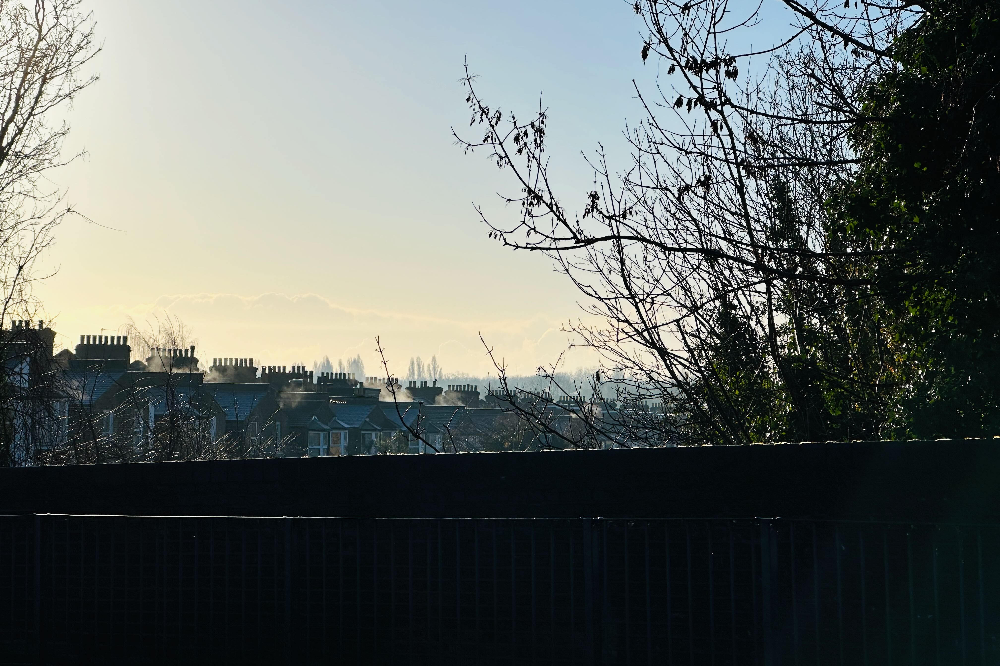
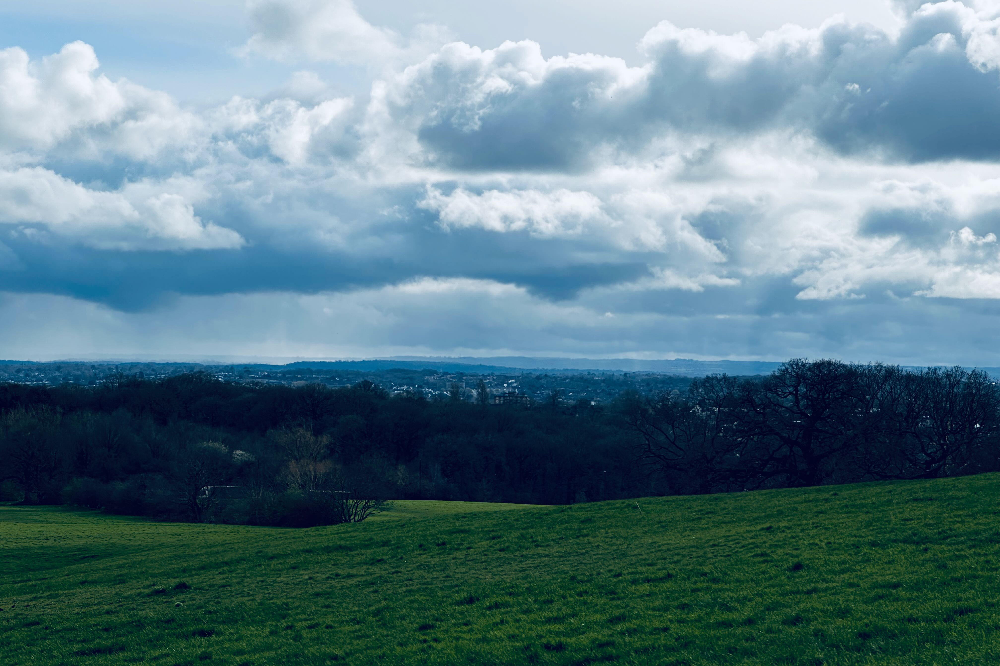
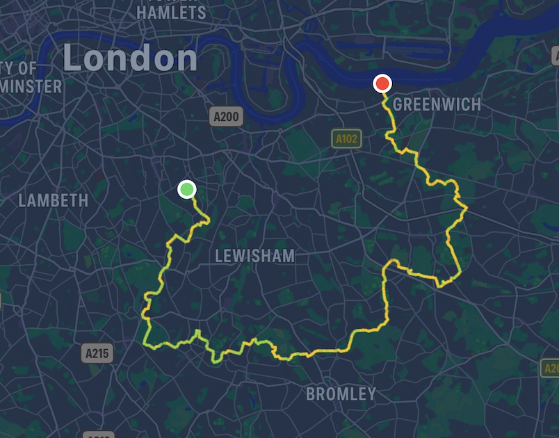

# The Green Chain Walk

*March 8, 2024*

For many years now I have been reading [Craig Mod](https://www.craigmod.com/)'s writings about his many long, mostly solo, walks throughout Japan, where he has lived for many years. I find the writing inspiring, the photos beautiful, and have long been a walker myself, who these days doesn't get as much of a chance to walk. 

This winter I managed to find a whole day to myself, a beautiful brisk London winter day, and I used it to walk 40km of the [Green Chain Walk](https://tfl.gov.uk/modes/walking/green-chain-walk), from Nunhead in south London, a few miles from my house and home to a beautiful old [cemetery](https://en.wikipedia.org/wiki/Nunhead_Cemetery), to the [Thames Barrier](https://en.wikipedia.org/wiki/Thames_Barrier).  

I really enjoyed the way this walk had been put together. It essentially connects together all the large green public spaces in southeast London, with nicely signposted routes and emphasis on spending as much time as possible somewhere green. 

<!-- 



As the above picture shows, -->

The walk is very clever at finding every single bit of green space it can, walking through parks, sports fields, along tree-lined streets, and in the extreme south-east edge of the map there are even a few fields and paddocks to walk through. This is all broken up by interludes, some as long as 1.5km, along the grimy streets of South London. Some of the areas are beautiful, some are not the nicest places to be walking. But there is always the next Green Chain signpost calling you on, helping you find the next escape into greenery. 

