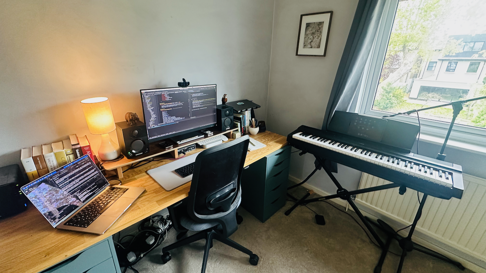

# My setup

*January 2025*

In this post I answer the interview questions from [uses this](http://usesthis.com/) - again. This is an updated version of [this post]() which I wrote in 2021, and is now the fifth time I have answered these questions. I have enjoyed reading *uses this* for many years and I like having a little archive of my own setups - you can see the five times I have done this exercise here. 

## Who are you and what do you do?

I'm an Australian mathematician and software engineer living in London. I'm currently working at [Via](https://ridewithvia.com). Outside of work, I enjoy reading, writing, listening to and making music, and spending time with my family. 

## What hardware do you use?

I have two 14" MacBook Pros from 2021 with the M1 Pro "Apple Silicon" processor - one from work, and one for my personal use. I never mix the two, never sign into personal accounts (iCloud, email, whatever) on my work computer, and vice versa. The M1 MacBook Pro is definitely the best computer I've ever owned - I wrote up a bit more about why I love it [here](https://www.mtsolitary.com/20220328150308-m1_pro_macbook_pro/). At my desk at home, I have my work computer hooked up to a 27" Lenovo monitor, and my personal computer to the side for playing music through a Behringer UR-22 audio interface and some cheap but decent Samson BT3 studio monitors, which I also use in my spare time to record music, when I get the chance. My recording setup is simple: alongside the UR-22 I use Shure SM58 and 57 microphones and a Yamaha P-121 digital piano. It's a basic setup but it works for the basic stuff I do.

Also on my desk is my trusty NAS - a Synology server with lots of storage which functions as a backup and media server for my household. 

I have an iPhone 14 Pro, which I use to take all my photos these days (though many of the older photos on this site were taken with an Olympus E-PM1). An 11" iPad Air gets used when I'm making and recording music, or for video calls to relatives in far-away lands. I listen to music through AirPods Pro, which I also have in my ears most of the day for remote meetings at work. My home stereo which gets a lot of use is a half-decent Sonyo receiver hooked up to some Wharfedale speakers. I also have an Apple Watch. 

## And what software?

I use [emacs]() to edit almost all of my text files, which is the majority of what I do with my personal computer these days (writing code is also editing text files). I use org mode and org agenda to manage all my tasks, to dos and notes, with the excellent Beorg app on iOS to handle everything through my phone. All my files and photos are backed up at least three times - you can read about my backup solution [here](https://www.mtsolitary.com/20230507063159-backups_public/). 

I browse the web in Safari and listen to music in Apple Music, where I have a huge amount of custom playlists I've put a lot of work into and am very happy with. For recording music I use Logic Pro. 

I also use a bunch of utilities to keep my computer sane: f.lux so my eyes don't get burnt out, Alfred to launch applications, Divvy to move windows around using keyboard commands and mclock to keep two time zones in my menu bar.

On my phone, apart from the obvious stuff like Messages, Whatsapp (ugh), Mail, Photos, Telegram, Signal and Phone, my homescreen consists of Calendar, Music, a bunch of navigation apps, Safari, Files, beorg for my todo lists and tasks, and iAWriter for editing Markdown on the go. I deleted all my social media accounts years ago. 

## What would be your dream setup?

An infinitely fast and thin laptop computer, with infinite battery. Perfectly comfortable headphones I can wear all day, and a completely lossless music collection. Apart from that I'm pretty happy with how things are at the moment: slowly but surely getting better, just like me. 
