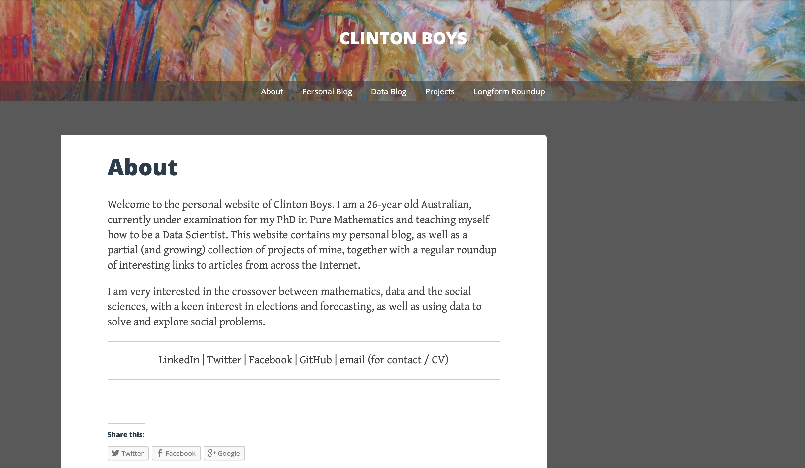
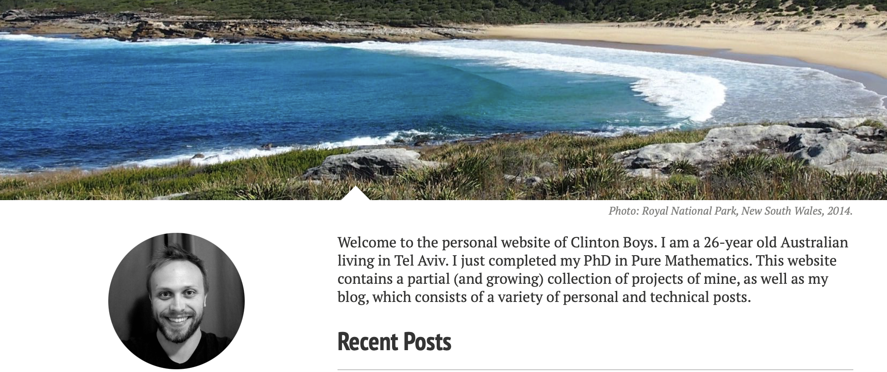

# clintonboys.com

*July 2014*

Last year, while in the middle of my PhD, I decided it was about time I had a personal website. I was considering a move out of academia into technology, and I felt like I needed some sort of online presence to showcase my writing and some personal projects I was planning to hack together to demonstrate I knew how to code. I initially threw together a very simple site at Wordpress that looked something like this (image courtesy of the [Wayback Machine](https://web.archive.org/web/20141216231359/http://clintonboys.com/)). 

Once I had made the decision finally, I bought my own domain &mdash; clintonboys.com, what an empowering moment! &mdash; and started building out a site myself, for fun and as another indication of my technical chops. 

After reading some other folks' blogs and researching static site generators a bit (after understanding that's what I needed), I chose Jekyll, since it seemed simple enough. I hacked away at an existing, open-sourced theme called [Minimal Mistakes](https://mmistakes.github.io/minimal-mistakes/) for a while until I came up with something that felt like it was mine. I really like the large feature images on every page, which gives me a chance to show off some of my favourite photographs that I've taken and also adds a bit of colour. 

## Update (2025)

After ten years of the Jekyll version of this site, in early 2025 I migrated clintonboys.com to Hugo. I wrote up a detailed post about the migration [here](). For posterity, I've included a screenshot of the site as it looked in 2014 below; there are also quite a few snapshots available to browse on the Wayback Machine. I made some tweaks over the years: in 2020 or so I removed the images in a fit of minimalism and then in 2024 I added them back and made a few more changes to the design which I outlined [here](). 

