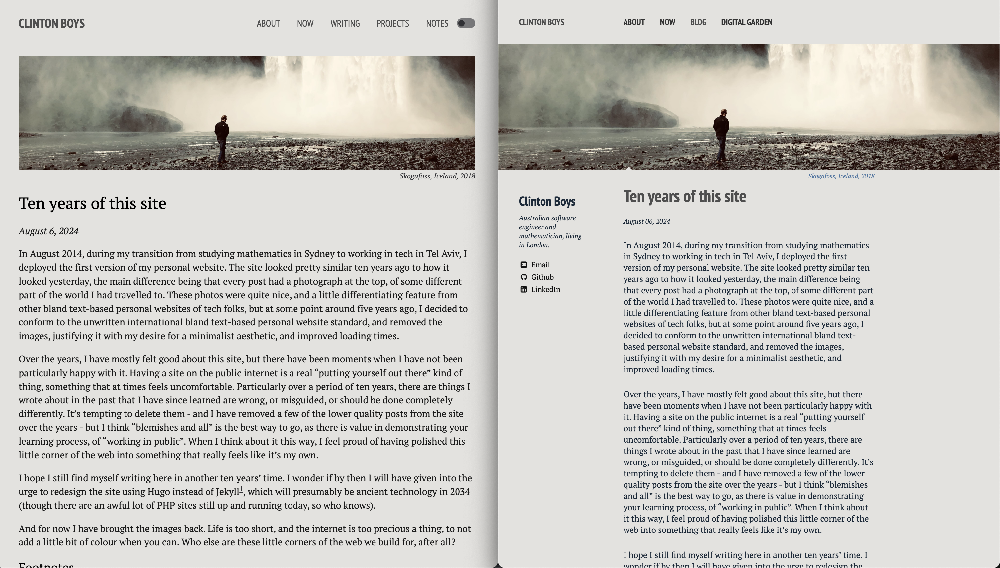

# Migrating my personal site to Hugo

*January 1, 2025*

As foreshadowed in my recent [post]() reflecting on ten years of running my personal website, I recently migrated the site to [Hugo](https://gohugo.io/) after many years of blogging with Jekyll[^1]. I used the [Liftoff](https://github.com/wjh18/hugo-liftoff?tab=readme-ov-file) theme by [Will Holmes](https://github.com/wjh18) as my starting point, and ended up making a large number of customisations - mostly in the CSS, to get back to a similar look and feel that I had in my old site, but also some changes a bit deeper in the templating structure. 

There were quite a few reasons for the change:

- **Something new**. I enjoy constantly reshaping, rewriting and rebuilding things I have made. It means I am continuously polishing and improving this site, shaving off little things that shouldn't be there, going over all the copy again, and just generally spending time honing something - [sanding](https://blog.jim-nielsen.com/2024/sanding-ui/) it - which is a very calming and enjoyable pastime for me. 
- **Portfolio**. This was the big one. My old Jekyll theme (which was a *heavily* customised fork of a very old version of the [Minimal Mistakes](https://mmistakes.github.io/minimal-mistakes/) theme by [Michael Rose](https://mademistakes.com/)) didn't have a built-in portfolio section, and I didn't really feel like sinking time into learning enough Jekyll to shoehorn one in myself. My new site has a shiny [portfolio]() section, with pride of place in the top navigation bar, showcasing a bunch of projects I have managed to finish (or half finish) in some form over the years. 
- **Dark mode**. It seems like you can't have a techy personal website these days without a fancy switch that toggles between light and dark mode, defaulting to the setting of the user's browser. The Liftoff theme came with this built in, so all I had to do was tweak the exact theme colours to my liking. I ended up using the same background colour for dark mode that I have used for five years over at [Mt Solitary](https://www.mtsolitary.com/), my digital garden. 
- **Hugo**. I chose Jekyll ten years ago, but Hugo feels a lot more modern, is significantly faster, and doesn't have the Ruby dependency, which always gave me trouble. I also have used Hugo to successfully build [other]() [websites]() in the last few years so I've built up a bit of experience and comfort with it. It just feels a lot lighter and more future-proof. 
- **Reading time indication**. Another nice little feature of the theme I built around was a built-in reading time indication for [posts](). Of course this would have been easy to add myself, but it was nice that it came out of the box. 
- **Tags**. There is also built-in support for tags (called "categories") in Liftoff, which means you automatically get pages like here. 
- **Vercel**. I had already done this in my ten-year revamp of the Jekyll site, but deployment is now done through [Vercel](https://vercel.com) instead of GitHub Pages. Vercel is a bit more flexible, offers a nice interface for managing multiple projects at once, and offers a very generous free "hobbyist" plan for personal project sites like mine.  

Here's a picture of the two sites side-by-side. On the left, the new Hugo site, on the right, the old Jekyll site (now archived [here](https://clintonboys-github-io.vercel.app)). You can see the overall design is quite similar. 

As for the list of things I *lost* in the migration:

- In the old site I had an author information sidebar on each post, which included email, LinkedIn and GitHub links, and a profile picture on the non-article pages. 
- Feature images are now smaller and do not spread to the full width of the window. 
- Text on large screens has gone from 560px to 900px wide.
- There are no longer year groupings in the blog section. 

I think most of these are actually desirable changes - I prefer the slightly wider look and I had got a bit sick of looking at my face all the time. If people want to see what I look like, they can click through to my LinkedIn or GitHub profiles from the [about]() page and see it there. 

I did the migration very manually, copying pages over one by one and fixing up things that needed to be fixed. A few times during the migration of over fifty pages, I thought about trying to automate some of the migration, but in the end I found it a much more meditative process to go over everything manually. It also let me catch a few decade-old typos. For each page, the things I had to change were

- front matter and feature image
- mathematics typesetting
- internal links

The things I had to tweak globally were

- theme colours
- web fonts
- mathematics typesetting
- Goatcounter support
- completely rejigged the navigation bar
- changed the "feature image" to be more like I had on my old site, including an image caption
- migrate some posts to a "project" format instead of a "post" format
- tweak the copyright footer to include an AI statement

I enjoyed this project, it really forced me to take a deep look at my online presence and rethink how I want it to look for the decade to come. The end result is something that feels really suited to me, and I'm very happy with it. 

## Footnotes

[^1]: Hugo and Jekyll are both "[static site generators](https://en.wikipedia.org/wiki/Static_site_generator)" (SSGs). If you don't know what that means, unfortunately this post will probably not mean a whole lot to you. 
