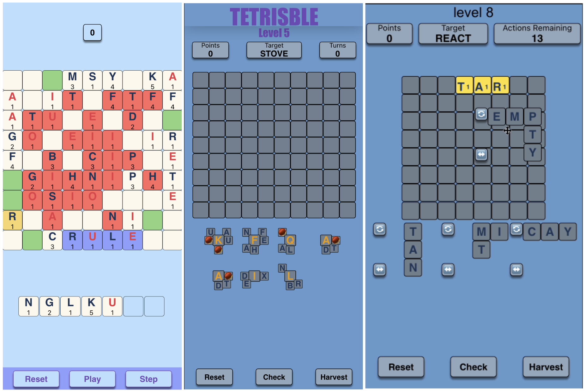
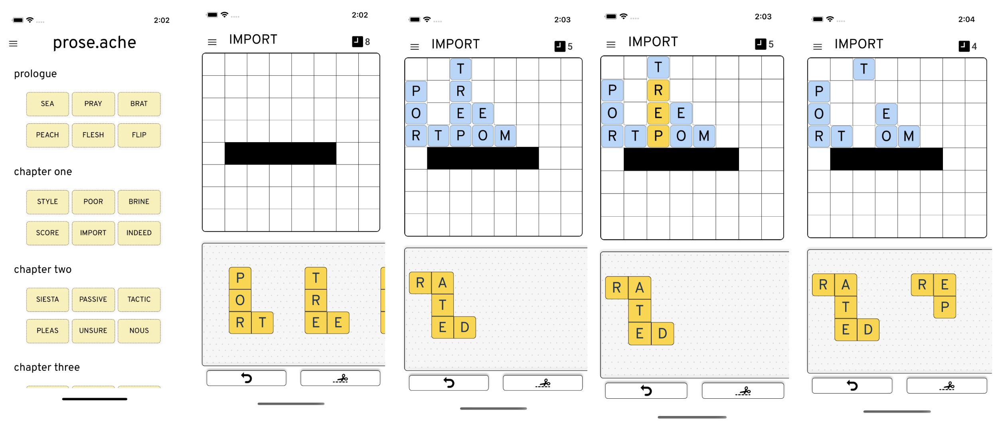
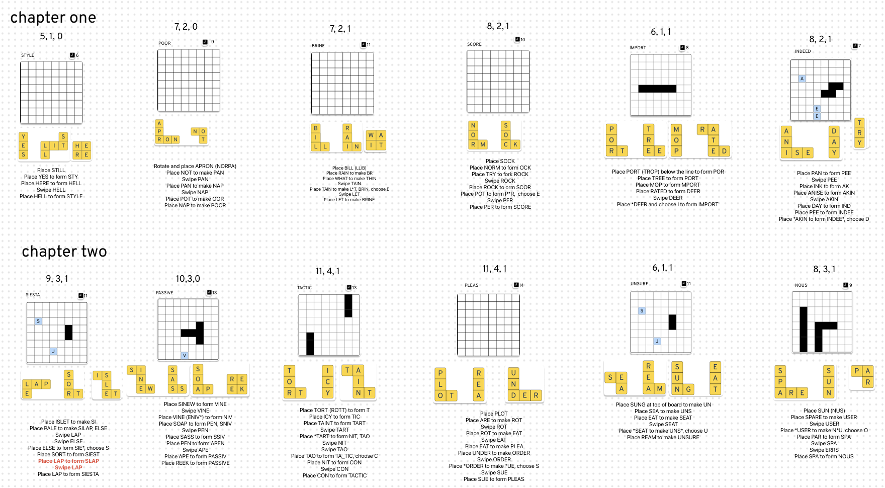

# prose.ache

*December 12, 2022*

prose.ache is a word game I built for iOS using [React Native](), inspired by Scrabble and Tetris. I chose the name because it is reminiscent of the word "prosaic", and the obscure mechanic that drives the game can make your head hurt a bit. 

My friend and I were looking for a good way to learn React Native, and decided that making a word game would probably be a good way to do it (Wordle was big in 2022). So we started off playing around with an idea based on Conway's Game of Life; my friend's game forked into a sort of candy crush-inspired word game, and mine became this interesting mash of ideas from Tetris and Scrabble. 

In the image below I have chosen three screenshots from the game in various stages of its early development. On the left, very early on, you can see the influence of Game of Life and Scrabble: the tiles are coloured according to their "state" in the Game of Life simulation: red tiles are about to "die", and other colours are about to "spawn" new tiles in the next iteration. 

I quickly realised that the randomness of Game of Life isn't particularly conducive to interesting word games, so I brought in a Tetris mechanic, which is clear in the second screenshot: the user is given some blocks of tiles, that can be placed on the board as a single unit. The seeds corresponded to "wild cards" that you could choose to be whatever letters you liked, and to win the level you needed to form the "goal word" written at the top. The working title at this point was "Tetrisble", a mix of "Tetris" and "Terrible" because I hadn't worked on the design at all yet. 

This mechanic ultimately stuck, though I got rid of the seeds and made the tiles rotateable, as in the third screenshot. The "harvest" button, a mechanic that also persisted into the final game, 

Finally I managed to work on the design. I made the board look a bit like a crossword puzzle and used Scrabble-y fonts to make it all look a bit nicer. "Harvest" turned into a "cut" mechanic, where if you managed to spell a word that was in the dictionary, but not the goal word, on the board, you could cut it out and have it come down again as a tile. This mechanic actually allowed for a fairly interesting game! 

After I had finished coding up the mechanics and had settled on something I liked, the rest of the work was designing the "first-time user experience" and all of the levels, to make this an actually interesting game that people would want to play and keep playing. This was by far the hardest bit for me - more challenging than coding the game up or designing the mechanisms, and also more of a "grind". But it was definitely an important step and felt very good when it all fell into place.

The final step, which I'm still working on and hope to finish off one day, is to do all the remaining administrative and polishing tasks to actually get this deployed to the App Store and have it available for purchase! When that happens I'll be sure to post an update to this site with details on how you can get your hands on prose.ache. 

