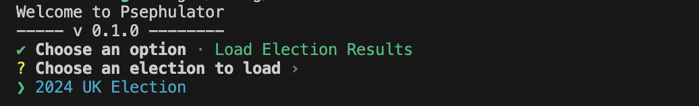
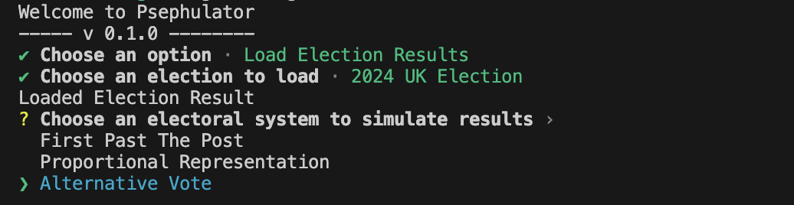
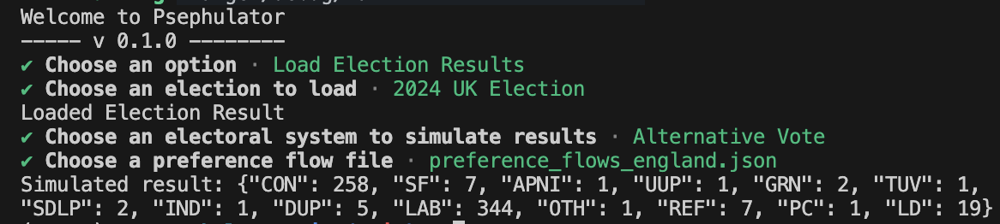

# Psephulator

*February 2, 2024*

Over the years I have done a few thought experiments on this site which could all be categorised as "taking the results from a real-world election and simulating them under a different electoral system": 

- The 2019 United Kingdom election simulated under an ["AV" preferential voting system]()
- Fifty years of Australian federal elections simulated under party-list [proportional representation]()
- The 2016 Australian federal election under a New Zealand-style [mixed system]()

I think these projects are very interesting in demonstrating how subtle changes to electoral systems can have a significant impact on the results of the election, and more generally supports a long-standing hypothesis of mine: that the political landscape in any particular country (or state, region, whatever) is dramatically influenced by the electoral system there. 

I wanted to build a tool that allows anyone to run these sorts of experiments, and more generally, to play with hypothetical scenarios based on real-world election data and electoral systems. 

## The idea for Psephulator

Psephulator[^1] is an open-source command-line tool for simulating elections. 

## Key components of Psephulator

### Election results database

### Electoral system engine

### Simulation engine

## Example - 2024 UK Election under AV

## Footnotes

[^1]: The name is inspired by the word [psephology](https://en.wiktionary.org/wiki/psephology), which is the analytical or statistical study of elections and electoral systems. 

