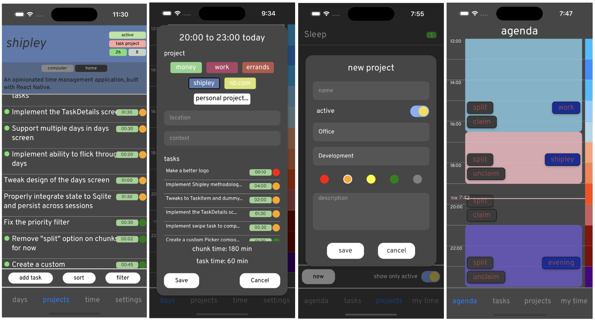

# Shipley

*November 10, 2023*

Shipley is an "opinionated" time and task management application for iOS that I am currently building using [React Native](). I have built a prototype, and it looks something like this:

The concept for the app is based around three main ideas. 

## Tasks

The tasks we do everyday, which in sum become our lives, can be broadly classified into two types: 

**Errand**

Errands are inherently time- and location-based. They are clear and atomic things that must be done.  They are often repeating tasks.

The main Errand view shows the errands for the day. They can be filtered by tag or location. They can be ordered by priority. There is a simple interface for adding errands. 

*Examples of errands*:

- Pay the electricity bill
- Clean the cat litter
- Renew the car insurance

## Projects

Projects are goal-based. They are large things that must be broken down into smaller atomic pieces. Projects should be worked on with deliberation and in isolation (see "Chunks" below). 

Projects have simple names. Shipley is opinionated and thinks you should choose a single word code name for each project. It has a couple of preset code-name banks based on various botanical and geographical themes.

Although it may feel strange, you are encouraged to nurture the relationships in your life in the same way as more traditional projects.
In this way you can see how you are investing your time. 

*Examples of project tasks*:

- Get in touch with Alex
- Complete the assignment for MATH-2904
- Spend time with my family

## Chunks and the calendar

Your day is divided into chunks.

There is a sleeping chunk, which you must set during onboarding.
Apart from sleeping, every part of your day should be assigned to some chunk.

There are some things that you may not want to assign to chunks like

- commuting
- daily hygeine routines
- eating

and in the strictest use of Shipley methodologies, these are pretty much the only things (though "pure Shipley" will also assign chunks to these things). 

## The prototype

The app is split between four screens:

- Agenda
- Tasks
- Projects
- My time  

**Agenda**

In the Agenda screen, you can see your calendar for today (and move between days). The day is split into chunks of one of three types:

- "unclaimed" chunks. Clicking these gives you the option to either create a named chunk, or immediately assign a project task to the chunk
- "named" chunks. Clicking these gives you the option to assign a task to the chunk.
- "named and claimed" chunks. "Working on task Z from project X during chunk Y". Clicking on this gives you the option to edit the project or change the status of the task.

At the bottom of the agenda is the list of errands scheduled for the day. 

**Tasks**

In the Tasks screen, you see a list of tasks and can apply filters. You can also create new tasks. Clicking on a task gives you the option to edit it or assign it to a chunk.

Filter by:

- tag
- priority
- location
- time
- project
- active/inactive project

Default filters:

- "inbox": no project, sorted by created ts
- "today": scheduled for today
- "next in active": unscheduled tasks in active projects with high priorities

**Projects**

A list of all projects. 

**My time**

A summary of how your time is spent, including statistics for previous days and weeks, the amount of assigned and unassigned chunks, and a counter of the week number of your life (inspired by [4000 Weeks](https://en.wikipedia.org/wiki/Four_Thousand_Weeks:_Time_Management_for_Mortals)). 

