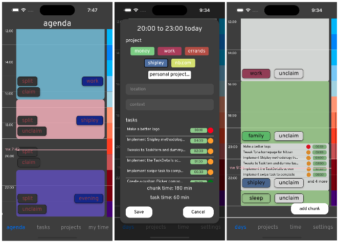
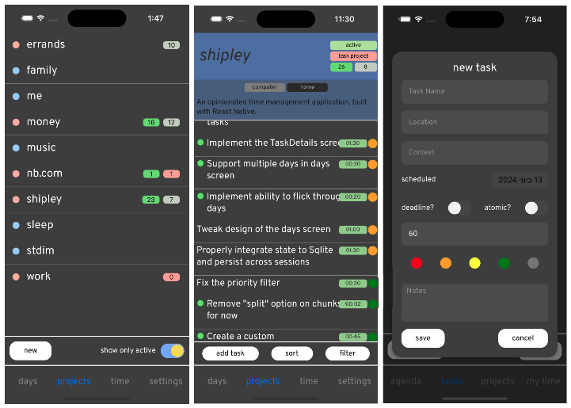
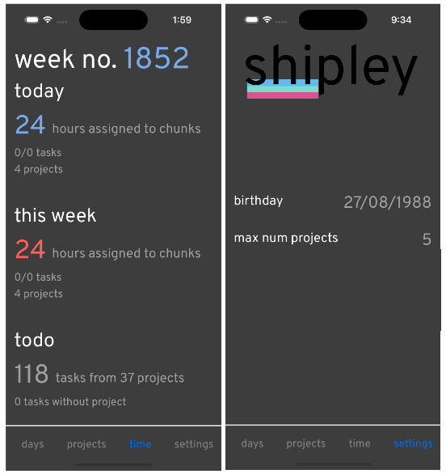

# Shipley

*November 10, 2023*

Shipley is an "opinionated" time and task management application for iOS that I am currently building using [React Native](). I have built a prototype, with a deliberately austere and unfinished design so I can focus on the central idea, and at the moment it looks something like this:

The concept for the app is based around three main ideas. 

## Errands and projects

The tasks we do everyday, which in aggregate determine how we spend our lives, can be broadly classified into two types: 

**Errands**

Errands are inherently time- and location-based. They are clear and atomic things that must be done.  They are often repeating tasks. It should always be easy to see the errands for a given day, but unless they have a deadline they can usually be done whenever. They can be filtered by tag or location. They can be ordered by priority. There is a simple interface for adding errands. 

*Examples of errands*:

- Pay the electricity bill
- Clean the cat litter
- Renew the car insurance

**Projects**

Projects are goal-based. They are large things that must be broken down into smaller atomic pieces. Projects should be worked on with deliberation and in isolation (see "Chunks" below). They have simple names. Shipley is opinionated, and it thinks you should choose a single word code name for each project. It has a couple of preset code-name banks based on various botanical and geographical themes[^1]. Although it may feel strange, you are encouraged to nurture the relationships in your life in the same way as more traditional projects.
In this way you can see how you are investing your time. 

*Examples of projects*:

- Friendship with Alex
- Complete MATH-2904
- A meaningful relationship with my family

*Examples of project tasks*:

- Get in touch with Alex
- Complete the assignment for MATH-2904
- Spend time with my family

Projects can be "active" or "inactive", and Shipley discourages you from having more than a few active projects at the same time. Active projects should be those that you are working on actively at the moment, that are occupying your thoughts and your attention. You can easily toggle projects between active and inactive, and if a project is completely finished it can be archived. 

## Chunks and the calendar

Your day is divided into "chunks", which are just blocks of time where you are only doing one thing. There is a sleeping chunk, which you must set during onboarding, and, if you take the "Shipley methodology" very seriously, every part of your day should be assigned to some chunk. There are some things that you may not want to assign to chunks like

- commuting
- daily hygiene routines
- eating
- spending time with loved ones

## The prototype

The Shipley app is based around three main screens.

**Agenda**

In the Agenda (or "Days") screen, you can see your calendar for today (and move between days). The day is split into chunks of one of three types:

- "unclaimed" chunks. Tapping these gives you the option to either create a named chunk, or immediately assign a project task to the chunk
- "named" chunks. Tapping these gives you the option to assign a task to the chunk.
- "named and claimed" chunks. "Working on task Z from project X during chunk Y". Tapping on this gives you the option to edit the project or change the status of the task.

At the bottom of the agenda is the list of errands scheduled for the day. 

**Projects and tasks**

In the Projects screen, you see a list of all projects, by default only showing the active ones. Tapping on a project will show a filterable list of all the tasks in that project. You can also create new tasks. Tapping on a task gives you the option to edit it or assign it to a chunk. There is a rich filtering functionality, allowing you to create custom filters based on properties like tags, priority, location, time the task will take, effort, project, etc. There are also some default filters which are useful:

- *Inbox*: no project, sorted by time created
- *Today*: specifically scheduled for today
- *Next in active*: unscheduled tasks in active projects with high priorities

**My time**

A summary of how your time is spent, including statistics about completed project tasks and errands for previous days and weeks, the amount of assigned and unassigned chunks today and in the coming days, and a counter of the week number of your life (inspired by [4000 Weeks](https://en.wikipedia.org/wiki/Four_Thousand_Weeks:_Time_Management_for_Mortals)), to remind you how little time you have to do anything at all, how many things you are going to leave undone, and how important it is to decide carefully and with great consideration what you are going to work on.  

I am still actively working on Shipley - stay tuned for more updates, and hopefully one day soon a link to buy it from the iOS App Store!

## Footnotes

[^1]: Shipley itself is still a working title that comes from my own "bank" of project names, related to the [Blue Mountains](https://en.wikipedia.org/wiki/Blue_Mountains_(New_South_Wales)), where I grew up. The Shipley Plateau is a beautiful sandstone plateau in the north-eastern part of the Blue Mountains escarpment. 
